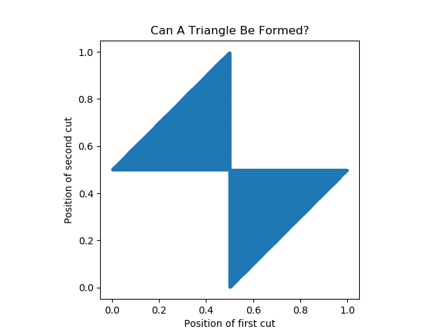

# Solution: Stick Cutting

You can read and run `stick_cutting.py` to see what the solution is.

Without any command-line parameters, it defaults to just running a
Monte Carlo experiment: pick uniform random cutting positions, and see
if the triangle inequality is satisified by the resultant sticks.

Other execution modes can be selected.  With `--mode text_state_space`
it will print out a graph in a terminal window (you must have `xterm`
installed) to show you what combinations of first and second cut
positions would result in three sticks that can form a triangle.  With
`--mode state_space`, you get a graphical representation (you can
resize it to make it bigger, etc).

The output will look something like the state-space plot in the figure.

Let us go through what it represents.

First, note that without loss of generality, we can assume that the
stick is of length 1.0, since any length L can be scaled --
equivalently, we make special rulers such that the stick is of length
1, and proceed from there.

Next, let us consider what has to occur if we are to _not_ be able to
form a triangle.  In order for the triangle inequality to be violated,
one of the sticks must be of length 1/2 plus 𝜀 or longer -- the
remaining two sticks, however the remaining material is to be
distributed between them, cannot close the gap.

Suppose in addition to the stick being cut A we had an auxillary stick
B such that the length of B is exactly half that of A.  After we make
two cuts on A, none of the resulting 3 fragments of A can be longer
than B.  This is why when the position of the first cut is at _x_ and
0 ≤ _x_ ≤ ½, the second cut at _y_ must satisfy:

* _y_ ≤ _x_ + ½

* ½ ≤ _y_

This yields the triangle in the upper left of the plot with vertices
(0, ½), (½, ½), and (½, 1).

A similar line of reasoning for ½ ≤ _x_ ≤ 1, which yields the triangle
in the lower right with vertices (½, ½), (½, 0), and (1, ½).
